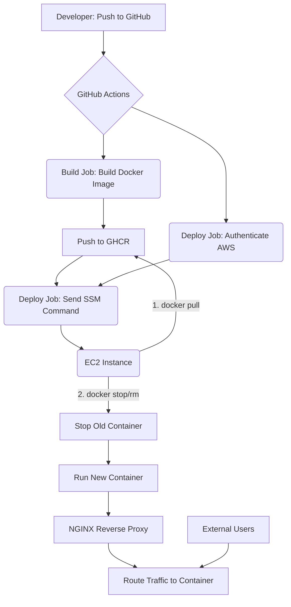

# Kenshi Resumes – AI-Powered Resume Builder

**Kenshi Resumes** is a cloud-native, AI-powered resume builder designed to simplify the creation of professional resumes through intelligent automation and modern DevOps practices. This project leverages a modern frontend stack, containerized deployment, infrastructure as code, and runtime configuration injection to ensure reliability, scalability, and ease of use in both local and cloud environments.

---

## Live Demo
Visit: [kenshi.krishnayadav.xyz](https://kenshi.krishnayadav.xyz)

---

## Features
- AI-assisted resume generation powered by API integrations.
- Lightweight, fast frontend built with Vite.
- Environment variables injected at runtime for secure configuration.
- Optimized multi-stage Docker build reduces image size from 2GB to ~100MB.
- Automated CI/CD pipeline using GitHub Actions.
- Infrastructure provisioned via Terraform (IaC) on AWS.
- Zero-SSH, SSM-driven container deployment ensures secure remote updates.

---

## Tech Stack
**Frontend**
- React (via Vite)
- JavaScript / HTML / CSS

**DevOps & Cloud**
- Docker (multi-stage builds)
- GitHub Actions (CI/CD automation)
- Terraform (infrastructure provisioning)
- AWS EC2, SSM, IAM
- GitHub Container Registry (GHCR)

---

## Project Structure
```
kenshi-resumes/
├── Dockerfile
├── docker-compose.yml
├── entrypoint.sh           # Substitute the env vars during runtime
├── example.env             # An example on how to keep the envvars set for compose
├── public/
│   └── env-configtemplate.js       # Injected at runtime with environment variables
├── dist/                   # Static production build, created during docker stages
├── terraform/
│   ├── main.tf             # EC2 instance definition
│   ├── variables.tf        # Variables
│   ├── roles_and_security.tf # IAM and Security Group config
    ├── userdata.sh          
│   └── backend.tf          # S3 remote state backend
└── .github/
    └── workflows/
        ├── build_docker_image.yaml       # Builds Docker image, pushes to GHCR and SSM-based container deployment on EC2
        ├── terraform_deploy.yml      # Get the infrastructure up and running
        └── tf_destroy.yaml     # Terraform destroy workflow
```

---

## Deployment Workflow

### Step 1: Build & Push Docker Image
Triggered via GitHub Actions (`build_docker_image.yaml`):
- Dockerfile is downloaded
- Image is built using multi-stage setup
- Image is pushed to GHCR under your GitHub namespace

### Step 2: Provision Infrastructure
GitHub Actions (`terraform_deploy.yml`) provisions:
- EC2 instance with AmazonSSMFullAccess
- Docker installed via `userdata.sh`
- Security group allowing ports 80 (HTTP) and 22 (SSH if needed)

### Step 3: Remote Deployment via SSM
GitHub Actions (`build_docker_image.yaml`) uses:
- AWS SSM to send remote shell commands
- Container pulled from GHCR and run with env vars
- No SSH required

#### Note: If in case we wish to remove the whole infrastructure and all our tools from aws, we simply have to execute `tf_destroy.yaml`.


---

## Runtime Environment Variables
These are injected into the app at runtime using a simple JS loader (`env-config.js`).

```bash
docker run -d \
  -e VITE_CLERK_PUBLISHABLE_KEY=your_key \
  -e VITE_GOOGLE_AI_API_KEY=your_key \
  -e VITE_STRAPI_API_KEY=your_key \
  -e VITE_BASE_URL=https://yourdomain.com \
  -p 80:4173 \
  ghcr.io/obsidianmaximus/kenshi-resumes-ai-powered:latest
```

---

## Local Development
```bash
# Install dependencies
npm install

# Run development server
npm run dev

# Build production files
npm run build

# Preview build locally
npm run preview -- --host
```

---

## Docker Usage
### Build Image
```bash
docker build -t kenshi-resumes .
```
### Run Locally
```bash
docker run -d -p 80:4173 --name kenshi-resumes kenshi-resumes
```

---

## Maintainer
**Krishna Yadav**  
[LinkedIn](https://linkedin.com/in/krishnayadavxyz) | [GitHub](https://github.com/ObsidianMaximus)

---

## Acknowledgements
- Inspired by the need for modern, user-friendly resume tools.
- Thanks to the open-source community for tools and inspiration.

---

For feedback, contributions, or deployment assistance, feel free to open an issue or connect on LinkedIn.
